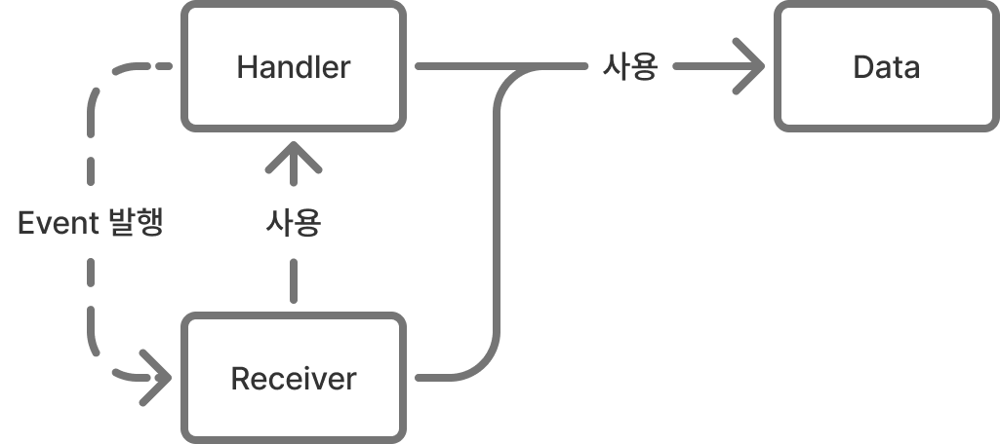

# 1. HR Architecure

이 문서는 Gamulpung Server의 Archtecture의 정의 입니다.

## 용어 정의
- Event : obj의 state변화입니다. Event 정의에는 domain logic이 반영됩니다.
- data : stateless합니다. 
- obj : statefull합니다. 이는 Handler의 의해 관리됩니다.
- Handler : obj를 관리합니다. 또한 obj의 엔트리 역할을 맡으며, 외부에 obj를 노출할 때 obj의 스넵샷(data)를 전달합니다. Event 발행의 주체입니다.
- Receiver : Event를 받아 domain logic을 수행합니다. Event 소비 주체입니다.

## Introduce
HR은 Handler-Receiver의 약자 입니다.
Event 기반의 아키택쳐로 Handler와 Receiver의 상호작용으로 동작합니다.

기존 아키텍쳐에는 Event의 발행과 소비의 주체가 명확하지 않아, Event 복잡도가 아주 높았습니다.
HR은 이런 문제를 해결하기 위해 제시되었습니다.

Event의 발행과 소비 주체를 명확히하며, Handler -> Receiver의 단방향 Event Flow를 구축합니다. 

## Layer
HR은 크게 3가지 Layer를 가집니다.
- DataLayer : Data, Event 정의
- HandlerLayer : obj, Handler 정의
- ReceiverLayer : Receiver 정의

Layer의 의존관계는 다음과 같습니다.

