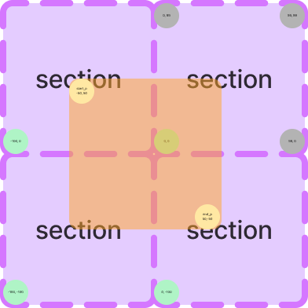

# Board

이 문서는 `Board`의 개념과 좌표 체계에 대한 설명입니다.

## Board
`Board`는 지뢰찾기가 진행되는 맵입니다.
이는 2차원 평면의 형태이며 무한한 크기를 가진다 가정합니다.

`Board`의 중심은 (0, 0)입니다.

## Section
`Section`은 `Boardhandler` scope에 국한된 개념입니다.

이는 `Tile`관리의 효율성을 위해 고안되었으며,
일정한 크기(100)에 높이와 넓이를 가진 `Tile`집합입니다.

`Section`은 Section 좌표를 가지며 이는 `sec(x, y)`와 같이 표기됩니다.
(0, 0) `Tile`을 가진 `Section`의 Section 좌표는 sec(0, 0)입니다.

sec(0, 0)의 범위는 (0, 99) 부터 (99, 0)입니다.

### 지역 좌표
지역 좌표는 `Section` 내부 좌표이며, 음수가 없고 (0, 0)부터 시작됩니다.
`rel(x, y)`와 같이 표기됩니다.

## 범위 좌표 접근
범위에 대해 좌표로 접근할 경우 좌상 부터 우하까지의 좌표를 명시하여 범위로 접근 합니다.

## 예
