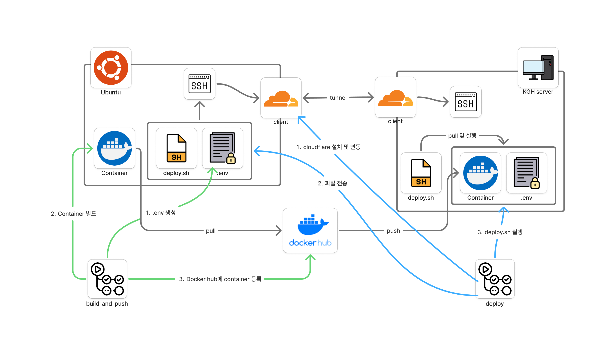

# 9. Deployment

이 문서는 Gamulpung Server의 배포 전략을 정의합니다.

## 용어 정의
- **Environment**: 배포 대상 환경. development(개발), production(프로덕션)으로 구분됩니다.
- **Deployment**: 빌드된 Docker 이미지를 서버에 배포하는 과정입니다.
- **Release Tag**: 프로덕션 배포를 트리거하는 Git 태그. `v*.*.*` 형식의 Semantic Versioning을 사용합니다.

## Introduce

개발 환경과 프로덕션 환경을 분리하여 안정적인 배포 프로세스를 구축합니다.
배포는 브랜치와 태그 기반으로 자동화되며, 각 환경은 GitHub Environments로 관리됩니다.

## Deployment Strategy

### 공통사항
- **SSH 연결**: Cloudflare Tunnel (유동 IP 환경)

### Development
- **트리거**: `develop` 브랜치에 push
- **배포 대상**: 개발 서버
- **Docker 태그**: `:dev`

### Production
- **트리거**: `v*.*.*` 형식의 태그 push
- **배포 대상**: 프로덕션 서버
- **Docker 태그**: `:latest`, `:v*.*.*`
- **제약사항**: Release Tag는 반드시 `main` 브랜치에서 생성되어야 합니다.

## Deployment Architecture

위 다이어그램은 전체 배포 아키텍처를 보여줍니다:

- **왼쪽 (Build-and-Push)**: GitHub Actions에서 소스코드를 빌드하여 Docker 이미지를 생성하고 Docker Hub에 푸시합니다.
- **오른쪽 (Deploy)**: GitHub Secrets에서 `.env` 파일을 생성하고, SSH를 통해 서버에 접속하여 배포 스크립트와 환경변수를 전송합니다.
- **서버**: `deploy.sh` 스크립트가 Docker Hub에서 이미지를 pull하고 환경변수와 함께 컨테이너를 실행합니다.

### 배포 플로우

1. **Build**: GitHub Actions에서 Docker 이미지를 빌드하여 Docker Hub에 푸시
2. **Deploy**: SSH로 서버에 접속하여 배포 스크립트와 `.env` 파일 전송
3. **Run**: 서버에서 이미지를 pull하고 컨테이너 실행

## 환경별 차이점

| 구분 | Development | Production |
|------|-------------|------------|
| SSH 연결 | Cloudflare Tunnel | Cloudflare Tunnel |
| 브랜치 | `develop` | `main` |
| Docker 태그 | `:dev` | `:latest`, `:v*.*.*` |
| 트리거 | Push to develop | Tag push (v*.*.*) |

## GitHub Environments

### Repository Secrets (공통)
- `DOCKER_USERNAME`: Docker Hub 사용자명
- `DOCKER_PASSWORD`: Docker Hub 비밀번호
- `DOCKER_REPONAME`: Docker Hub 레포지토리명

### Environment Secrets (development/production 공통)
각 환경마다 동일한 구조의 Secrets를 설정합니다:

- `DOTENV`: 환경변수 파일 내용
- `SSH_USERNAME`: SSH 사용자명
- `SSH_KEY_B64`: SSH 개인키 (base64 인코딩)
- `CONTAINER_NAME`: Docker 컨테이너명
- `CONTAINER_PORT_MAPPING`: 포트 매핑
- `CLOUDFLARE_TUNNEL_HOSTNAME`: Cloudflare Tunnel 호스트명
- `CF_ACCESS_CLIENT_ID`: Cloudflare Access Client ID
- `CF_ACCESS_CLIENT_SECRET`: Cloudflare Access Client Secret

## 보안

### .env 파일 보안
- `.env` 파일은 Git에 커밋되지 않습니다
- `.dockerignore`를 통해 Docker 이미지에도 포함되지 않습니다
- GitHub Secrets에서 런타임에만 생성되어 서버로 전송됩니다

### SSH 키 관리
- SSH 개인키는 GitHub Environment Secrets에서 관리됩니다
- 환경별로 다른 SSH 키를 사용하여 권한을 분리합니다

### 환경 분리
- Development와 Production은 완전히 독립된 GitHub Environment로 관리됩니다
- Production 배포는 main 브랜치 검증을 거쳐 안정성을 확보합니다
