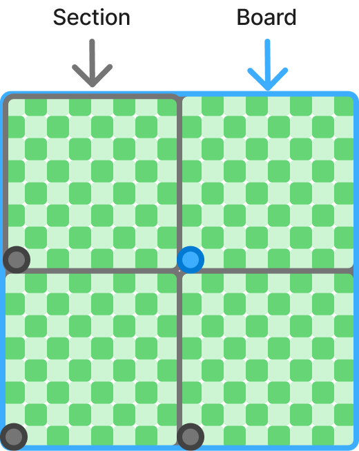
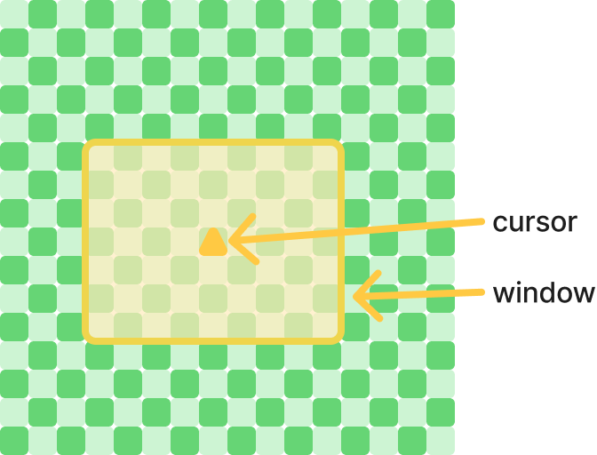

# Board와 좌표 체계

## 목적
다양한 Tile 집합의 정의와 좌표 체계

## 규칙

### Board
지뢰찾기를 진행하는 맵이다.
Tile로 이루어 있으며, 크기는 무한함을 가정한다.
- Board 기준점(파란점)은 (0, 0)이다.
- Board는 x축 y축을 가진 사분면 좌표계를 사용하여 내부 Tile의 위치를 표기한다.
- 모든 Tile의 기본 좌표는 Board의 좌표를 기준으로 하며, 이는 절대 좌표한다.
  `abs(x, y)`

### Area
Area는 임의의 Tile관리 단위이다.
크기가 유한하며, 그에 따라 양수(0을 포함)범위의 좌표만을 가진다.
- Area의 기준점(빨간점)은 (0, 0)이다.
- 기준점의 맞추어 Area내의 Tile을 접근할 수 있으며 이는 지역좌표이다.
  `rel(x, y)`

### Section
Section은 서버가 Tile을 관리하기 위해 마련한 정해진 크기의 Area이다.
- Section은 `N * N` 크기의 정사각형이다.
- Section을 특정하기 위해 섹션좌표를 가진다.
  이는 `abs(0, 0)`을 기준점으로 가지는 Section이 기준 Section이 되며, 이는 `sec(0, 0)`이다.

## 적용 범위
Board 관련 모든 구현에 적용된다.
