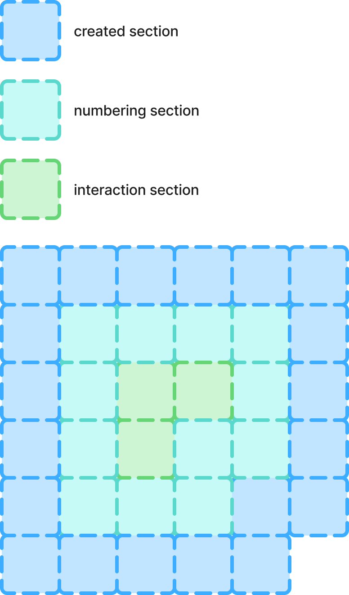

Section 생성 전략 및 numbering 방식을 정의합니다.

생성 전략의 채택 이유는 [ADR-002](/docs/ADR/%5BADR-002%5D%20Section%20생성%20전략%20채택.md)를 참조하세요.

## section 생성 방법
1. `numbering section`에 상호작용한다.
2. `numbering section`을 `interaction section`으로 격상하여 상호작용에 응답한다.
3. `numbering section` 주변 1칸의 `closed section`을 `numbering section`으로 격상한다.

### `closed section` -> `numbering section`
1. 주변 1칸의 `section`이 없다면 그 자리에 `closed section`을 생성한다.
2. 자신을 `numbering`한다.

## 기타
`Section`은 주변 `Section`의 상태 flag를 가진다.

## 참고

[GitHub Issue #13](https://github.com/gamultong/gamulpung-server-new/issues/13)
